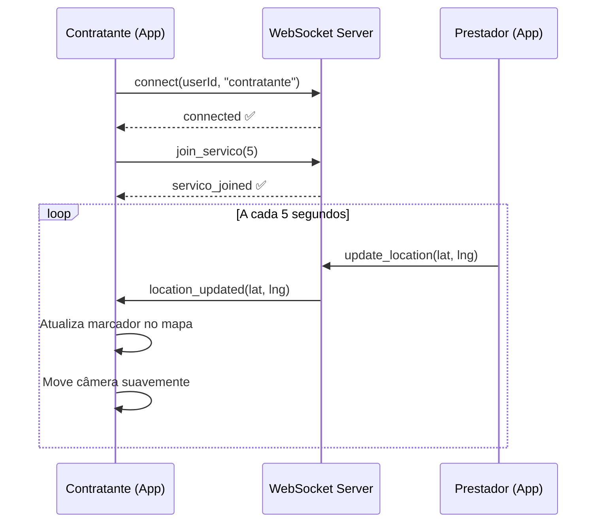

# 🧪 GUIA RÁPIDO DE TESTE - Rastreamento em Tempo Real

## ⚡ Teste em 3 Passos

### 1️⃣ Execute o App
```bash
# Conecte seu dispositivo/emulador
# No Android Studio, clique em Run (Shift+F10)
```

### 2️⃣ Abra o Logcat
```
Android Studio > Logcat
Filtre por: "WebSocket|TelaRastreamento"
```

### 3️⃣ Solicite um Serviço
- Faça login como **contratante**
- Solicite um serviço
- Aguarde prestador aceitar
- Será redirecionado para tela de rastreamento

---

## 📊 O Que Você Deve Ver

### ✅ No Logcat (Logs Esperados)

```log
🔌 WebSocketManager: Conectando ao WebSocket...
✅ WebSocketManager: Socket conectado!
✅ WebSocketManager: user_connected emitido: {"userId":1,"userType":"contratante","userName":"João"}

🚪 WebSocketManager: Entrando na sala do serviço: 5
✅ WebSocketManager: Evento join_servico emitido com sucesso
🎉 WebSocketManager: Entrou com sucesso no serviço 5: Conectado ao serviço 5

📡 TelaRastreamento: Recebido update WebSocket:
   ServicoId recebido: 5
   ServicoId esperado: 5
   Latitude: -23.550520
   Longitude: -46.633308
   Prestador: Danielson
   Timestamp: 2025-11-24T15:06:12.123Z

✅ TelaRastreamento: Posição ATUALIZADA via WebSocket!
   Nova posição: -23.550520, -46.633308
   Distância movida: 125.5 metros (aprox)

🎥 TelaRastreamento: Atualizando câmera para posição: -23.550520, -46.633308
   Câmera seguindo movimento
```

### ✅ Na Tela do App

**Header (Topo):**
```
🟢 Ao vivo               [ponto verde pulsando]
📍 2.5 km  ⏱️ 8 min
```

**No Mapa:**
- 🔵 **Marcador azul pulsante** = Prestador (em tempo real)
- 🟢 **Círculo verde** = Origem da rota
- ⚪ **Círculos brancos** = Paradas intermediárias
- 🔴 **Círculo vermelho** = Destino final
- **Linha verde** = Rota completa (3 camadas)

**Card Inferior:**
- Avatar do prestador com borda verde
- Nome, avaliação (⭐⭐⭐⭐⭐)
- Botões: "Ligar" e "Chat"
- Informações do veículo
- Botão "Cancelar Serviço"

---

## 🎯 Como Verificar se Está Funcionando

### ✅ Checklist de Validação

- [ ] Indicador mostra "🟢 Ao vivo" (não "🔴 Offline")
- [ ] Ponto verde está pulsando ao lado de "Ao vivo"
- [ ] Marcador azul aparece no mapa
- [ ] Marcador azul tem animação de halo pulsante
- [ ] Rota verde conecta todos os pontos
- [ ] Logs mostram "Posição ATUALIZADA via WebSocket!"
- [ ] Câmera move suavemente quando prestador se move
- [ ] Distância e tempo aparecem no header

### ❌ Se Algo Não Funciona

#### Problema: "🔴 Offline"
**Causa:** WebSocket não conectou

**Solução:**
1. Verifique Logcat: tem erro de conexão?
2. URL correta? `wss://facilita-c6hhb9csgygudrdz.canadacentral-01.azurewebsites.net`
3. Internet funcionando no dispositivo?
4. Servidor está online?

#### Problema: Marcador não se move
**Causa:** Prestador não está enviando localização

**Solução:**
1. Verifique se prestador está com app aberto
2. Prestador deve estar na tela de "Serviço em Andamento"
3. Prestador precisa ter GPS ligado
4. Verifique Logcat: está recebendo `location_updated`?

#### Problema: Rota não aparece
**Causa:** API Directions ou paradas não carregadas

**Solução:**
1. Verifique Logcat: "ERRO: API do Google não retornou rota"?
2. Google Maps API Key válida?
3. Directions API habilitada no Google Cloud Console?
4. Serviço tem paradas cadastradas?

---

## 🔬 Teste Avançado (Simulação)

### Simular Prestador em Movimento

Se você não tem um prestador real, pode simular:

1. **Instale o app em 2 dispositivos:**
   - Dispositivo 1: Login como **contratante**
   - Dispositivo 2: Login como **prestador**

2. **Crie e Aceite o Serviço:**
   - No dispositivo 1, solicite um serviço
   - No dispositivo 2, aceite o serviço
   - No dispositivo 2, inicie o serviço

3. **Movimente o Prestador:**
   - Caminhe com o dispositivo 2
   - Ou use "Fake GPS" no emulador
   - A cada X segundos, o app enviará a localização

4. **Observe no Contratante:**
   - Dispositivo 1 deve mostrar o marcador se movendo
   - Câmera segue automaticamente
   - Logs mostram cada atualização

### Usar Fake GPS no Emulador

**Android Studio Emulator:**
```
1. Extended Controls (ícone de "...")
2. Location
3. Digite coordenadas manualmente
4. Ou carregue uma rota GPX
5. Clique "Play Route"
```

---

## 📱 Comandos ADB Úteis

### Ver Logs em Tempo Real
```bash
adb logcat | grep -E "WebSocket|TelaRastreamento"
```

### Limpar Logs
```bash
adb logcat -c
```

### Verificar Conexão Internet
```bash
adb shell ping -c 3 google.com
```

### Forçar Parada do App
```bash
adb shell am force-stop com.exemple.facilita
```

---

## 🎬 Fluxo Completo de Teste



---

## 📸 Capturas de Tela Esperadas

### Tela Funcionando Corretamente:
```
┌─────────────────────────────────┐
│  ←  Serviço em andamento    ⋮  │
│     🟢 Ao vivo                   │
│     📍 2.5 km  ⏱️ 8 min        │
└─────────────────────────────────┘
│                                  │
│         [MAPA GOOGLE]            │
│                                  │
│    🔵 ← Prestador (pulsante)    │
│     \                            │
│      \  [Linha Verde]            │
│       \                          │
│    ⚪ ← Parada                   │
│         \                        │
│          \  [Linha Verde]        │
│           \                      │
│         🔴 ← Destino             │
│                                  │
└──────────────────────────────────┘
┌─────────────────────────────────┐
│  [Avatar]  Danielson             │
│            ⭐⭐⭐⭐⭐ 5.0          │
│            📞 (11) 98765-4321   │
│                                  │
│  [Ligar 📞]    [Chat 💬]        │
│                                  │
│  🚗 Veículo: Honda Civic Preto  │
│     Placa: ABC-1234              │
│                                  │
│  [❌ Cancelar Serviço]          │
└─────────────────────────────────┘
```

---

## ✅ Confirmação de Sucesso

Você saberá que está **100% funcional** quando:

1. ✅ Ver "🟢 Ao vivo" com ponto pulsante
2. ✅ Marcador azul pulsando no mapa
3. ✅ Logs mostrando "Posição ATUALIZADA"
4. ✅ Câmera seguindo suavemente o prestador
5. ✅ Rota verde conectando todos os pontos
6. ✅ Distância e tempo atualizando

---

## 🚀 Dica Final

**Execute ambos os comandos em terminais separados:**

Terminal 1 (Logs WebSocket):
```bash
adb logcat | grep WebSocketManager
```

Terminal 2 (Logs Tela):
```bash
adb logcat | grep TelaRastreamento
```

Assim você vê tudo em tempo real! 🎯

---

**Qualquer problema, verifique os logs primeiro! 90% dos problemas são visíveis lá.** 🔍

